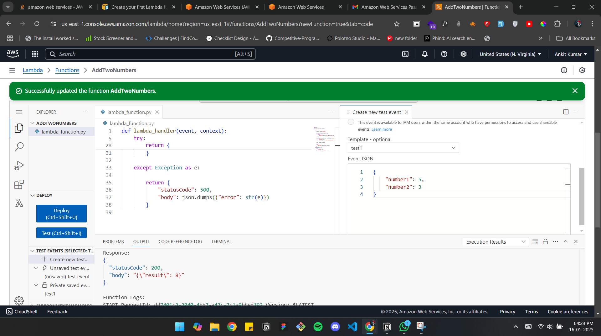
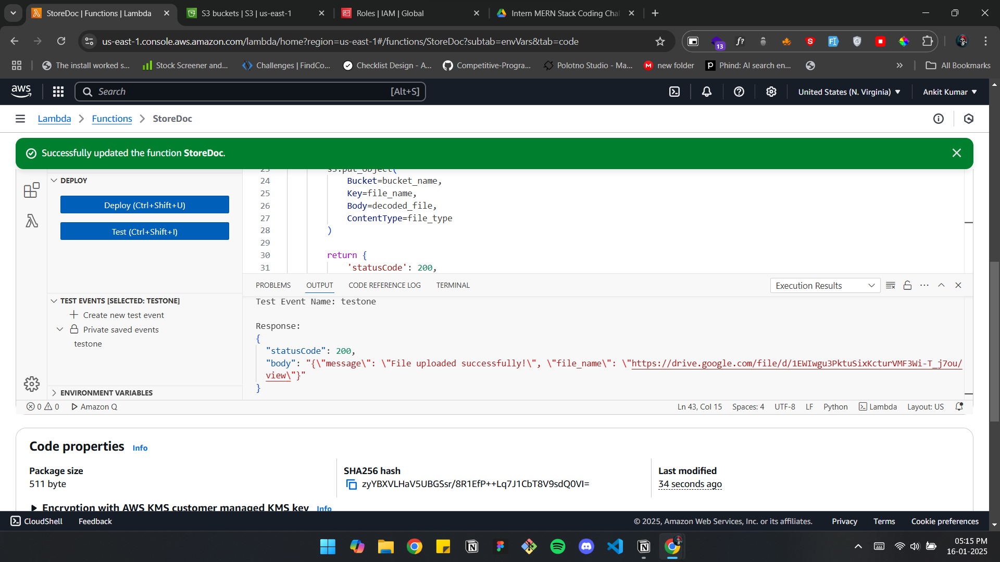

# AWS Lambda Functions

This repository contains two AWS Lambda functions:

1. **Addition Lambda Function**: Adds two numbers and returns the result.
2. **S3 Document Upload Lambda Function**: Stores a document or PDF file in an S3 bucket.

---

## Prerequisites

1. **AWS Account**: Ensure you have an active AWS account.
2. **AWS CLI**: Install and configure the AWS CLI with appropriate credentials.
3. **Node.js**: Ensure Node.js is installed for packaging the Lambda function (if using Node.js runtime).

---

## Setup

### 1. Addition Lambda Function


#### Description
This Lambda function takes two numbers as input, adds them, and returns the result.

#### Deployment Steps
1. Create a new Lambda function in the AWS Management Console.
2. Use the provided code for the addition functionality.
3. Test the function using the following JSON event:
   ```json
   {
       "number1": 5,
       "number2": 10
   }
   ```
4. Deploy the function and test to verify the output.

### 2. S3 Document Upload Lambda Function

#### Description
This Lambda function accepts a document or PDF file and stores it in a specified S3 bucket.

#### Deployment Steps
1. Create an S3 bucket where the files will be stored.
2. Create a new Lambda function in the AWS Management Console.
3. Add the provided code for the S3 upload functionality.
4. Attach an IAM role to the Lambda function with permissions to upload objects to the S3 bucket.
5. Test the function using the following JSON event:
   ```json
   {
       "file_content": "event body",
       "fileName": "example.pdf",
       "fileContent": "<base64-encoded-file-content>"
   }
   ```
6. Deploy the function and test to verify the file is uploaded to the S3 bucket.

---

## IAM Permissions

Ensure that the Lambda function has appropriate IAM permissions:

- **Addition Lambda Function**: No special permissions required.
- **S3 Document Upload Lambda Function**: Attach the following permissions to the Lambda execution role:
  ```json
  {
      "Version": "2012-10-17",
      "Statement": [
          {
              "Effect": "Allow",
              "Action": "s3:PutObject",
              "Resource": "arn:aws:s3:::<your-bucket-name>/*"
          }
      ]
  }
  ```

---

## Testing

1. Use the AWS Lambda Console or AWS CLI to test the functions.
2. Ensure the inputs match the JSON structure described above.
3. Verify the outputs:
   - For the addition function, the result should be the sum of the two numbers.
   - For the S3 upload function, check the S3 bucket for the uploaded file.

---

## Notes

- Replace `<your-bucket-name>` with the name of your S3 bucket.
- Ensure that the file content provided for the S3 upload is base64-encoded.
- Add any necessary error handling in the code to manage edge cases and exceptions.

---

## License

This project is licensed under the MIT License. See the LICENSE file for details.
