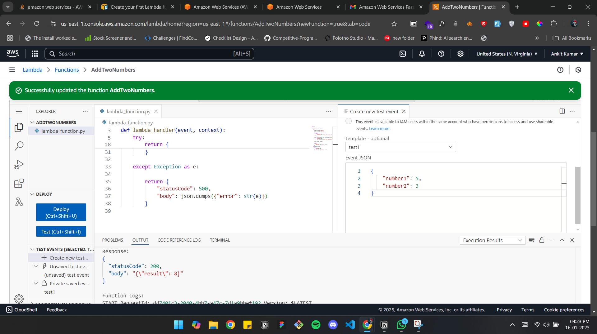
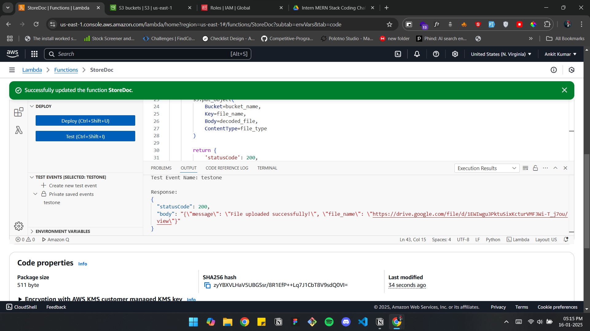

# 90North
# Project Overview

This repository contains three projects showcasing expertise in serverless functions, real-time communication, and responsive web design.

---

## 1. AWS Lambda Functions

### Overview  
Two AWS Lambda functions built for simple and practical tasks:
- **Addition Function**: Adds two numbers provided in the payload and returns their sum.
- **S3 Document Upload Function**: Uploads base64-encoded documents to an S3 bucket with proper IAM permissions.

### Demo
- **Addition Function Input**:  
  ```json
  {
      "number1": 5,
      "number2": 10
  }
  ```
  **Output**: `15`

- **S3 Upload Function Input**:  
  ```json
  {
      "file_content": "event body",
      "fileName": "example.pdf",
      "fileContent": "<base64-encoded-content>"
  }
  ```
  **Result**: File successfully uploaded to the S3 bucket.

### Screenshot

 



---

## 2. Django Real-Time Chat Application

### Overview  
A real-time chat application using Django with WebSocket support. Key features include:
- Instant messaging with no page refresh.
- Message history saved in the database.
- Multiple chat rooms and secure user authentication.

# Demo
<video controls src="2025-01-20 15-01-35.mp4" title="Title"></video>
[video link](<https://drive.google.com/file/d/1F2899jDNi6wGD_mFfC-xnNYK3qqguitN/view?usp=sharing>)


### Screenshots
 


---

## 3. Responsive Web Application with Dynamic Sidebar and Scaling

### Overview  
A responsive web application featuring:
- A collapsible sidebar for navigation.
- Dynamic scaling to fit different screen sizes.
- Quick links and recent activities sections for easy access.

### Demo
- Sidebar toggles between open (`☰`) and close (`❌`).
- Responsive design adapts seamlessly to mobile, tablet, and desktop views.
- Scales content dynamically based on screen width.

### Screenshots


---

This repository provides diverse examples of backend, real-time, and frontend application development. Feel free to explore and contribute!

