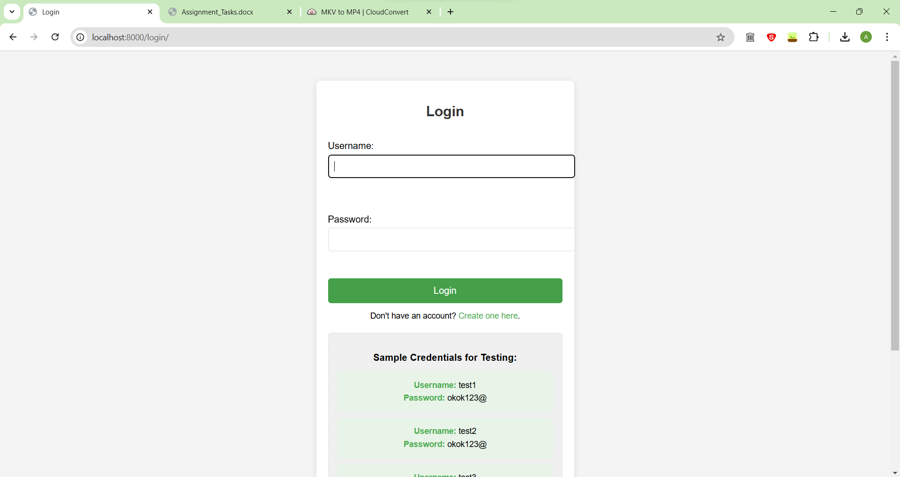
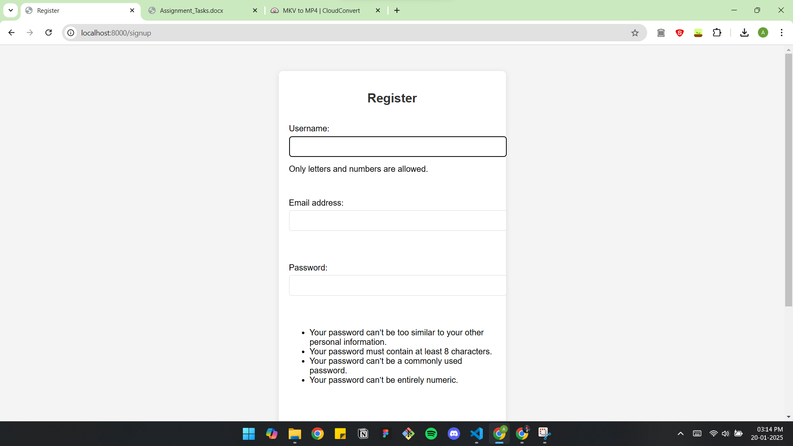

# Django Real-Time Chat Application

## Overview
This is a real-time chat application built with **Django** that uses **WebSockets** for instant messaging. It leverages **Django Channels** and **Daphne** for asynchronous communication. Messages are stored in the database, enabling users to view chat history in each room while enjoying a seamless real-time experience.

---

## Features
- **Real-Time Messaging**: Instant communication through WebSockets without page refreshes.
- **Message History**: All messages are stored in the database, allowing users to view past conversations in chat rooms.
- **Multiple Chat Rooms**: Users can join and participate in different chat rooms.
- **User Authentication**: Secure login and registration system using Django’s authentication framework.
- **Scalable Architecture**: Built with Django Channels and Daphne for handling WebSocket connections and asynchronous requests.

---

## Tech Stack
- **Backend**: Django (Python), Django Channels, Daphne (ASGI Server)
- **Frontend**: HTML, CSS, JavaScript
- **Database**: SQLite (development)
- **Protocol**: WebSocket for real-time communication

---

## Installation

### Prerequisites
- Python 3.8+
- Virtual Environment Tool (optional but recommended)

### Steps
1. Clone the repository:
   ```bash
   git clone https://github.com/ankit-o07/90North.git
   cd 90North/django/mychatapp
   ```

2. Create and activate a virtual environment:
   ```bash
   python3 -m venv env
   source env/bin/activate  # On Windows: env\Scripts\activate
   ```

3. Install dependencies:
   ```bash
   pip install -r requirements.txt
   ```

4. Apply database migrations:
   ```bash
   python manage.py migrate
   ```

5. Start the development server:
   ```bash
   python manage.py runserver
   ```

6. Access the app at `http://127.0.0.1:8000/`.

---

## Usage
- Register or log in to the application.
- Join a chat room to send and receive messages in real-time.
- View the chat history for each room.

---

## Deployment

### Using Daphne for ASGI
To deploy this application in a production environment with **Daphne**:
1. Install Daphne:
   ```bash
   pip install daphne
   ```

2. Update the deployment server to run Daphne instead of the default Django server:
   ```bash
   daphne -b 0.0.0.0 -p 8000 your_project_name.asgi:application
   ```

3. Configure your production server (e.g., Nginx) to proxy requests to Daphne.

---

## Contributing
Contributions are welcome! Feel free to submit a pull request or open an issue to suggest improvements or report bugs.

---

## License
This project is licensed under the MIT License. See the LICENSE file for details.

## Demo
<video controls src="2025-01-20 15-01-35.mp4" title="Title"></video>

[text](<2025-01-20 15-01-35.mp4>)


## Screenshots



